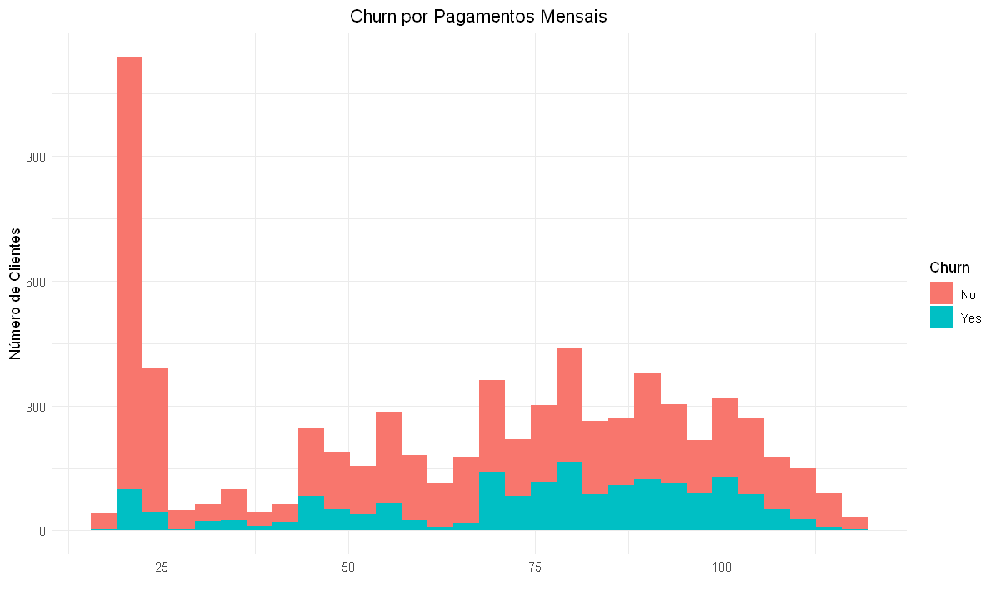
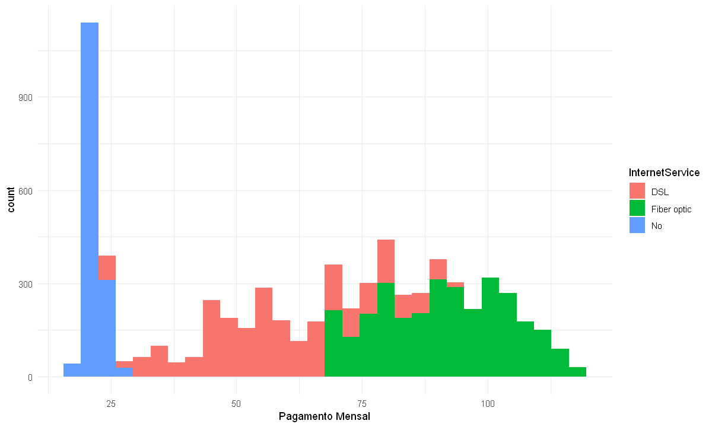
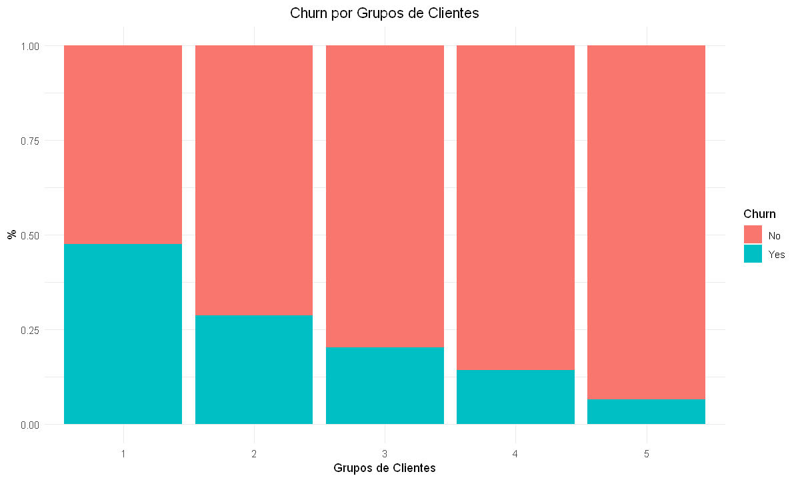
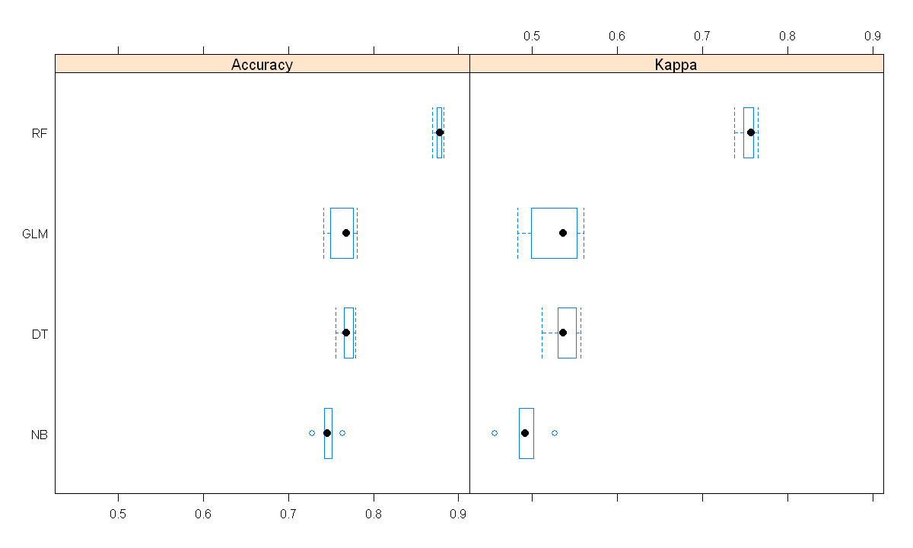
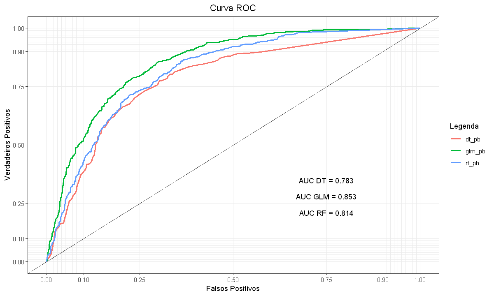

Esse é um projeto de classificação.

O conjunto de dados utilizado está disponível [neste link](https://www.kaggle.com/blastchar/telco-customer-churn). 

# Entendimento do Negócio

A EasyNet é uma empresa de telecomunicações que oferece serviços de telefonia, internet e TV por assinatura. Para esse segmento, saber e prever a taxa de cancelamento de serviços é bastante útil, pois há uma grande concorrência nesse mercado.

Atualmente, a taxa de rotatividade de clientes da empresa é de aproximadamente 25%. Visando diminuir esse número, a EasyNet resolveu implementar um projeto para identificar potenciais cancelamentos com antecedência, e assim, promover ações direcionadas para esses clientes a fim de mantê-los na empresa.

Durante a reunião de alinhamento do projeto, foi estabelecido que a equipe de dados ficará responsável por identificar os clientes mais propensos a abandonar os serviços da empresa e a área de Marketing deverá criar ofertas e planos customizados para esses clientes. Portanto, nesse projeto, nosso objetivo é criar um modelo capaz de responder a seguinte pergunta:

- **Quais clientes estão mais propensos a abandonar os serviços da EasyNet?**

# Dicionário de Dados

Em relação ao conjunto de dados, as seguintes informações foram disponibilizadas:

- Os dados estão em formato estruturado e serão disponibilizados em um arquivo "csv".
- A maioria das variáveis são categóricas.

Além disso, também foi disponibilizado o dicionário de dados:

| Variáveis         | Descrição                                  |
| ----------------- | ------------------------------------------ |
| customerID        | Identificação do cliente                   |                          
| gender            | Gênero do cliente                          |
| SeniorCitizen     | Indica se o cliente é da terceira idade    |
| Partner           | Indica se o cliente é casado               |
| Dependents        | Indica se o cliente possui dependentes     |
| tenure            | Tempo de contrato do cliente (em meses)    |
| PhoneService      | Serviço telefônico                         |
| MultipleLines     | Múltiplas linhas telefônicas               |
| InternetService   | Tipo de provedor de internet               |
| OnlineSecurity    | Serviço de segurança online                |
| OnlineBackup      | Serviço de backup online                   |
| DeviceProtection  | Proteção de dispositivo                    |
| TechSupport       | Suporte técnico                            |
| StreamingTV       | Serviços de streaming (TV)                 |
| StreamingMovies   | Serviços de streaming (filmes)             |
| Contract          | Tipo do contrato                           |
| PaperlessBilling  | Fatura eletrônica                          |
| PaymentMethod     | Método de pagamento                        |
| MonthlyCharges    | Valor pago mensal                          |
| TotalCharges      | Valor total já pago pelo cliente           |
| Churn             | Cancelamento do serviço                    |

# Estratégia da Solução

Como estratégia para a solução do projeto, definimos as seguintes etapas:

- **1. Entendimento do Negócio:** essa etapa é basicamente o que vimos até aqui: especificamos o problema de negócio, entendemos a necessidade do cliente e definimos nossos objetivos.

- **2. Entendimento dos Dados:** nosso objetivo é tratar as principais inconsistências observadas, e realizar uma análise exploratória a fim de entender o que as variáveis representam.

- **3. Engenharia de Atributos:** utilizaremos os dados disponíveis para criar uma nova variável, e assim, facilitar o aprendizado dos modelos. Além disso, também realizaremos a seleção das melhores variáveis.

- **4. Pré-Processamento dos Dados:** aqui, temos como objetivo preparar os dados para a etapa da modelagem preditiva. Iremos dividir os dados em conjuntos de treino e teste e aplicar técnicas como, balanceamento de classes, codificação e normalização de variáveis.

- **5. Modelagem Preditiva:** criaremos modelos utilizando alguns dos principais algoritmos de classificação.

- **6. Comparando os Modelos:** baseado na ROC AUC, vamos comparar os modelos criados a fim de selecionar o de melhor desempenho.

- **7. Conclusões Finais:** por fim, entregaremos o resultado final do projeto.

# TOP 3 Insights 

**1. Clientes com pagamentos mensais mais altos possuem maior taxa de rotatividade.**

**2. Além de possuir a maior taxa de rotatividade, a internet por fibra ótica possui os maiores pagamentos mensais.**

**3. Aproximadamente 50% dos clientes com contrato de até 12 meses cancelaram os serviços da empresa.**

# Modelagem Preditiva

Os seguintes modelos foram testados:

- *Logistic Regression*;
- *Naive Bayes*;
- *Decision Tree*;
- *Random Forest*.

**OBS: Apesar do bom desempenho do *Random Forest*, foi constatado que o modelo está sobreajustado.**

# Comparando os Modelos

Para comparar os modelos utilizaremos a Curva *ROC* e a *AUC* que são ferramentas para medir o desempenho de modelos de classificação.

# Conclusões Finais

Os modelos treinados com o *Random Forest* e a Regressão Logística foram os que apresentaram os melhores resultados. Para a entrega final desse primeiro ciclo, optamos pelo modelo com a Regressão Logística, pois esse obteve um resultado semelhante ao primeiro, e está mais generalizável. Abaixo segue as métricas do modelo com os dados de teste:

| **Model**              | **Accuracy**    | **Precision**    | **Recall**    | **F1-score**    |
|:----------------------:|:---------------:|:----------------:|:-------------:|:----------------|
| *Logistic Regression*	 | 0.7566          | 0.5271	          | 0.8161        | 0.6405          |

Para um primeiro ciclo do projeto, esses resultados são satisfatórios, porém, podemos perceber que há uma dificuldade do modelo em prever a classe positiva, e isso, deverá ser considerado para um próximo ciclo. Nesse caso, algumas tarefas que poderiam ajudar são:

- Aumentar a quantidade de registros da classe positiva para o treinamento do modelo.
- Avaliar outros métodos de balanceamento de classes.

Além disso, também poderia ser realizado:

- Treinamento do modelo considerando apenas as melhores variáveis.
- Otimização dos hiperparâmetros do modelo.
- Avaliação de outros classificadores.

Implementando essa primeira versão do modelo, a EasyNet conseguirá identificar em média 52,7% dos clientes que abandonarão os serviços da empresa.

# Autor

Rafael Felippe  

